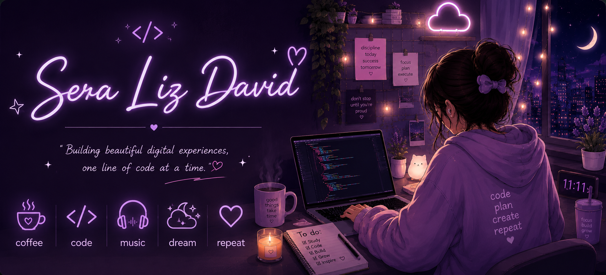

<div align="center">



# 🌸 Hi, I'm Sera Liz David

### Flutter Developer • Frontend Developer • Computer Science Engineering Student

Building responsive applications with Flutter, React and modern web technologies.

</div>

---

# 🌷 About Me

```yaml
Name: Sera Liz David

Location: Kerala, India

Education:
  B.Tech in Computer Science Engineering

Focus:
  - Flutter Development
  - Frontend Engineering
  - Responsive UI Design

Currently Learning:
  - React
  - Next.js
  - Firebase
  - Data Structures & Algorithms

Interests:
  - Mobile Applications
  - Web Development
  - Clean UI/UX
```

---

# 💜 Tech Stack

<p align="center">


<br><br>


<br><br>


</p>

---

# 📊 GitHub Statistics

<p align="center">


</p>

<p align="center">


</p>

---

# 🚀 Featured Projects

### 💹 AI Trading Dashboard
Modern trading dashboard built with **React**, **Next.js**, and real-time market visualization.

---

### 🛍️ Liz Shop
Flutter e-commerce application with Firebase Authentication and Firestore integration.

---

### 🍔 Food Delivery App
Cross-platform Flutter application featuring a modern ordering experience.

---

### 💰 Expense Tracker
Personal finance management application built using Flutter.

---

# 🌱 Currently Learning

- React & Next.js
- Firebase
- Data Structures & Algorithms
- Modern Frontend Development

---

# 🤝 Connect With Me

<p align="center">

<a href="https://linkedin.com/in/sera-liz-david-6842a8327">

</a>

&nbsp;&nbsp;&nbsp;

<a href="https://github.com/sera-liz">

</a>

</p>

---

<div align="center">

### Thanks for visiting 👋


</div>
